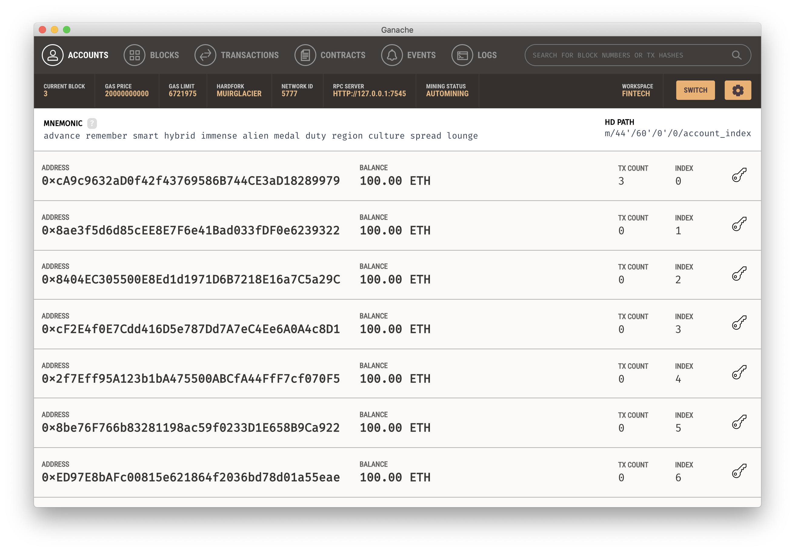

# Blockchain-Tools

Screenshots of connecting MyCrypto to custom chain of Ganache, importing the pre-funded wallet, and sending test transactions.

* First, get the private key of the pre-funded address using Ganache (installed and downloaded from 'https://www.trufflesuite.com/ganache')

* Open up MyCrypto, then click `Change Network` at the bottom left

* Click "Add Custom Node", then add the custom network information that is in the Ganache. The URL is pointing to the default RPC port on your local machine. Use `http://127.0.0.1:7545`.

* Once you save and use the network, double-check that it is selected and is connected.

Now that you are connected to your blockchain, you will need to load a private key that you created and funded in Ganache.

* On the left pane menu of MyCrypto, click on "View & Send".

* Next, click on the "Private Key" option to continue.

* A new window will pop-up, paste the private key of the pre-fund wallet and click on the "Unlock" button to continue.

* This is the balance that was pre-funded for this account in Ganache; however, these ETH tokens are just for testing purposes.

Now we're going to send a transaction to ourselves to test it out. Follow the next steps.

* Copy the pre-fund address into the "To Address" field, then fill in an arbitrary amount of ETH:

* Confirm the transaction by clicking "Send Transaction", and the "Send" button in the pop-up window.

* Click the `Check TX Status` when the green message pops up to update the status.

That was the first transaction sent on this blockchain network. 

Included are some of the screenshots of MyCrypto wallet and Ganache:

